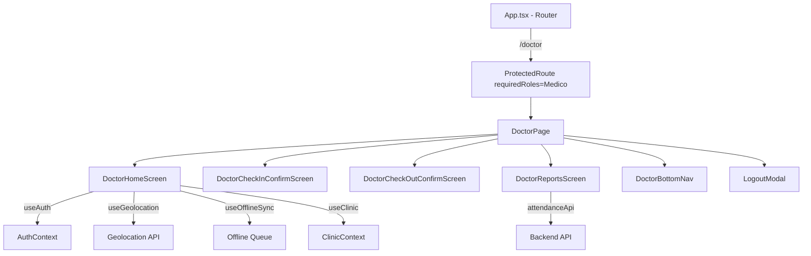
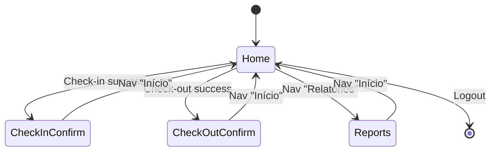

# Design Document: Doctors Screen Migration

## Overview

Esta migração converte a página estática `frontend/public/medico.html` em componentes React integrados à SPA existente. A tela original é uma experiência mobile-first com autenticação biométrica (simulada), check-in/check-out de plantão, relatórios e navegação inferior com 5 abas.

A estratégia é criar uma nova rota `/doctor` com sub-rotas internas gerenciadas por estado local (não sub-rotas do React Router), replicando o padrão de "screens" do HTML original onde apenas uma tela é visível por vez com animações de transição.

### Design Decisions

1. **Estado local vs sub-rotas**: O HTML original usa `.screen.active` para alternar telas. Replicamos isso com um `useState<Screen>` ao invés de sub-rotas no React Router, mantendo a URL `/doctor` fixa e as transições animadas entre telas internas.

2. **CSS Module isolado**: Todo o CSS do `medico.html` será extraído para um CSS Module (`DoctorPage.module.css`) para evitar colisão com estilos globais da aplicação.

3. **Reutilização de hooks existentes**: Usaremos `useAuth`, `useGeolocation`, `useOfflineSync`, `useNetworkStatus` e `useClinic` sem modificação.

4. **Biometria simulada**: A autenticação biométrica do HTML original é uma animação decorativa (não há integração real com FaceID). Na migração, como o usuário já está autenticado via AuthContext, a tela de biometria será **removida** — o médico entra diretamente no dashboard ao acessar `/doctor`.

## Architecture



### Fluxo de telas interno



## Components and Interfaces

### Novos arquivos a criar

| Arquivo | Responsabilidade |
|---------|-----------------|
| `frontend/src/pages/DoctorPage.tsx` | Componente página principal, gerencia estado de tela ativa |
| `frontend/src/pages/doctor/DoctorHomeScreen.tsx` | Tela Home com saudação, relógio e botões check-in/check-out |
| `frontend/src/pages/doctor/DoctorCheckInConfirmScreen.tsx` | Tela de confirmação de check-in |
| `frontend/src/pages/doctor/DoctorCheckOutConfirmScreen.tsx` | Tela de confirmação de check-out |
| `frontend/src/pages/doctor/DoctorReportsScreen.tsx` | Tela de relatórios com filtros e estatísticas |
| `frontend/src/pages/doctor/DoctorBottomNav.tsx` | Barra de navegação inferior |
| `frontend/src/pages/doctor/LogoutModal.tsx` | Modal bottom-sheet de confirmação de logout |
| `frontend/src/pages/doctor/DoctorPage.module.css` | Estilos CSS extraídos do medico.html |
| `frontend/src/pages/doctor/icons.tsx` | Componentes SVG inline (logo, ícones de nav) |
| `frontend/src/pages/doctor/types.ts` | Tipos locais (Screen enum, ReportFilters, etc.) |
| `frontend/src/pages/doctor/useReportStats.ts` | Hook para cálculo de estatísticas de relatório |
| `frontend/src/pages/doctor/useClock.ts` | Hook para relógio em tempo real (HH:mm) |

### Interface do DoctorPage (componente raiz)

```typescript
// types.ts
export type DoctorScreen = 'home' | 'checkin-confirm' | 'checkout-confirm' | 'reports';

export interface ConfirmationData {
  type: 'checkin' | 'checkout';
  dateTime: Date;
  clinicName: string;
}

export interface ReportFilters {
  startDate: string | null;
  endDate: string | null;
  clinicId: string | null;
}

export interface ReportStats {
  totalShifts: number;
  totalHours: number;
  avgHoursPerShift: number;
}
```

### DoctorPage — State Machine

```typescript
function DoctorPage() {
  const [screen, setScreen] = useState<DoctorScreen>('home');
  const [confirmData, setConfirmData] = useState<ConfirmationData | null>(null);
  const [showLogoutModal, setShowLogoutModal] = useState(false);

  // Screen switching with fadeUp animation via CSS class
  return (
    <div className={styles.doctorRoot}>
      {screen === 'home' && <DoctorHomeScreen onCheckedIn={...} onCheckedOut={...} />}
      {screen === 'checkin-confirm' && <DoctorCheckInConfirmScreen data={confirmData} />}
      {screen === 'checkout-confirm' && <DoctorCheckOutConfirmScreen data={confirmData} />}
      {screen === 'reports' && <DoctorReportsScreen />}
      <DoctorBottomNav activeScreen={screen} onNavigate={setScreen} onLogout={...} />
      {showLogoutModal && <LogoutModal onConfirm={...} onCancel={...} />}
    </div>
  );
}
```

### DoctorBottomNav Props

```typescript
interface DoctorBottomNavProps {
  activeScreen: DoctorScreen;
  onNavigate: (screen: DoctorScreen) => void;
  onLogout: () => void;
}
```

### useClock Hook

```typescript
function useClock(): string {
  // Returns formatted time "HH:mm", updates every second
}
```

### useReportStats Hook

```typescript
function useReportStats(records: Attendance[]): ReportStats {
  // Computes totalShifts, totalHours, avgHoursPerShift
}
```

## Data Models

### Tipos existentes reutilizados (sem alteração)

- `Attendance` — registro de presença com checkIn/checkOut times, lat/lng
- `CheckInRequest` / `CheckOutRequest` — DTOs de requisição
- `Clinic` — informação da unidade
- `AuthUser` — dados do usuário logado (userId, email, roles, clinicId)
- `OfflineAttendanceEvent` — evento enfileirado para sync offline

### Novos tipos

```typescript
// frontend/src/pages/doctor/types.ts

export type DoctorScreen = 'home' | 'checkin-confirm' | 'checkout-confirm' | 'reports';

export interface ConfirmationData {
  type: 'checkin' | 'checkout';
  dateTime: Date;
  clinicName: string;
}

export interface ReportFilters {
  startDate: string | null;  // ISO date string YYYY-MM-DD
  endDate: string | null;
  clinicId: string | null;
}

export interface ReportStats {
  totalShifts: number;
  totalHours: number;
  avgHoursPerShift: number;
}
```

### API Endpoints utilizados

| Endpoint | Método | Uso |
|----------|--------|-----|
| `POST /attendance/check-in` | POST | Registrar entrada |
| `POST /attendance/check-out` | POST | Registrar saída |
| `GET /attendance/my-history` | GET | Histórico de presença |
| `POST /attendance/sync` | POST | Sincronizar eventos offline |
| `GET /clinics` | GET | Lista de unidades para filtro |

### Route Configuration

```typescript
// Adição em App.tsx
<Route
  path="/doctor"
  element={
    <ProtectedRoute requiredRoles={['Medico']}>
      <DoctorPage />
    </ProtectedRoute>
  }
/>
```

Também adicionar link no menu de navegação da AppLayout para profissionais com role "Medico".

## Correctness Properties

*A property is a characteristic or behavior that should hold true across all valid executions of a system — essentially, a formal statement about what the system should do. Properties serve as the bridge between human-readable specifications and machine-verifiable correctness guarantees.*

### Property 1: Route access control

*For any* user object, access to the `/doctor` route SHALL be granted if and only if the user's roles array contains "Medico".

**Validates: Requirements 1.1, 1.2**

### Property 2: Clock time formatting

*For any* valid JavaScript Date object, the `formatTime` function SHALL produce a string matching the pattern `HH:mm` (two-digit hour, colon, two-digit minute, 24h format).

**Validates: Requirements 1.5**

### Property 3: User name display

*For any* authenticated user with a non-empty name/email, the Doctor_Dashboard SHALL render output containing that user's display name.

**Validates: Requirements 1.4**

### Property 4: Attendance API payload correctness

*For any* attendance action (check-in or check-out) and *any* valid geolocation coordinates (latitude in [-90, 90], longitude in [-180, 180]), the API call payload SHALL contain those exact coordinates and a non-empty deviceId string.

**Validates: Requirements 2.1, 3.1**

### Property 5: Confirmation screen data completeness

*For any* successful attendance response with a valid timestamp and clinic name, the confirmation screen SHALL render the doctor's name, formatted date, formatted time, and clinic name.

**Validates: Requirements 2.2, 3.2**

### Property 6: Report statistics computation

*For any* list of attendance records where each record has valid checkInTime and checkOutTime, the computed statistics SHALL satisfy: `totalShifts == records.length`, `totalHours == sum of (checkOutTime - checkInTime) for each record`, and `avgHoursPerShift == totalHours / totalShifts` (or 0 when empty).

**Validates: Requirements 4.2**

### Property 7: Date range filtering

*For any* date range [startDate, endDate] and *any* list of attendance records, the filtered result SHALL contain only records whose checkInTime date falls within [startDate, endDate] inclusive.

**Validates: Requirements 4.3**

### Property 8: Unit filtering

*For any* selected clinicId and *any* list of attendance records, the filtered result SHALL contain only records whose clinicId matches the selected clinicId.

**Validates: Requirements 4.4**

### Property 9: Record rendering completeness

*For any* attendance record with checkInTime, checkOutTime, and clinicId, the rendered record item SHALL contain a formatted date, a formatted check-in time, a formatted check-out time (or placeholder if null), and a badge indicating type.

**Validates: Requirements 4.5**

### Property 10: Offline queue preservation

*For any* attendance event (check-in or check-out) that fails due to a network error, the event SHALL be stored in the offline queue with the same shiftId, coordinates, userId, clinicId, and attendanceType as the original request.

**Validates: Requirements 7.1, 7.2**

### Property 11: Pending indicator visibility

*For any* non-empty list of offline events with status "Pending" or "Failed", the Doctor_Dashboard SHALL display the pending operations indicator as visible.

**Validates: Requirements 7.4**

## Error Handling

| Cenário | Comportamento |
|---------|--------------|
| API check-in/check-out retorna 4xx | Exibir mensagem de erro do backend ao médico |
| API check-in/check-out retorna 5xx ou timeout | Enfileirar na fila offline, exibir mensagem "salvo offline" |
| Sem conexão ao clicar check-in/check-out | Enfileirar imediatamente, exibir banner offline |
| Geolocalização negada/indisponível | Exibir mensagem de erro específica, não permitir ação |
| API relatórios falha | Exibir mensagem "Erro ao carregar relatórios", botão retry |
| Token expirado durante ação | axiosInstance interceptor renova token automaticamente |

### Estratégia de fallback offline

1. Detectar falha de rede via `isNetworkError()` existente
2. Chamar `enqueueOfflineEvent()` do hook `useOfflineSync`
3. Exibir confirmação visual ao médico (evento salvo localmente)
4. Auto-sync quando `isOnline` muda para `true` (comportamento existente do hook)

## Testing Strategy

### Abordagem dual

**Testes unitários (example-based)**:
- Renderização correta do BottomNav com 5 abas
- Redirect para /login quando não autenticado
- Loading states durante requisições
- Fluxo de telas (home → confirm → home)
- Modal de logout abre/fecha corretamente
- Active tab highlighting por rota

**Testes de propriedade (property-based)**:
- Cada property acima será implementada como um teste PBT usando `fast-check`
- Mínimo 100 iterações por propriedade
- Tag format: `Feature: doctors-screen-migration, Property N: {title}`

### Configuração PBT

- Biblioteca: **fast-check** (já padrão para projetos TypeScript/Vitest)
- Runner: **Vitest** (já configurado no projeto)
- Arquivo: `frontend/src/pages/doctor/__tests__/doctor.property.test.ts`
- Cada property test referencia o número e título da propriedade do design

### Foco dos testes

| Camada | Tipo de teste | O que valida |
|--------|---------------|--------------|
| `useReportStats` | PBT | Cálculo correto de estatísticas (Property 6) |
| `useClock` / `formatTime` | PBT | Formato HH:mm para qualquer Date (Property 2) |
| Filtering logic | PBT | Filtros de data e unidade (Properties 7, 8) |
| Route protection | PBT | Acesso baseado em roles (Property 1) |
| Check-in/out flow | PBT + Unit | Payload API + offline queueing (Properties 4, 10) |
| Confirmation render | PBT | Dados completos na tela (Property 5) |
| Componentes visuais | Unit/Snapshot | Fidelidade visual ao medico.html original (Req 6) |
