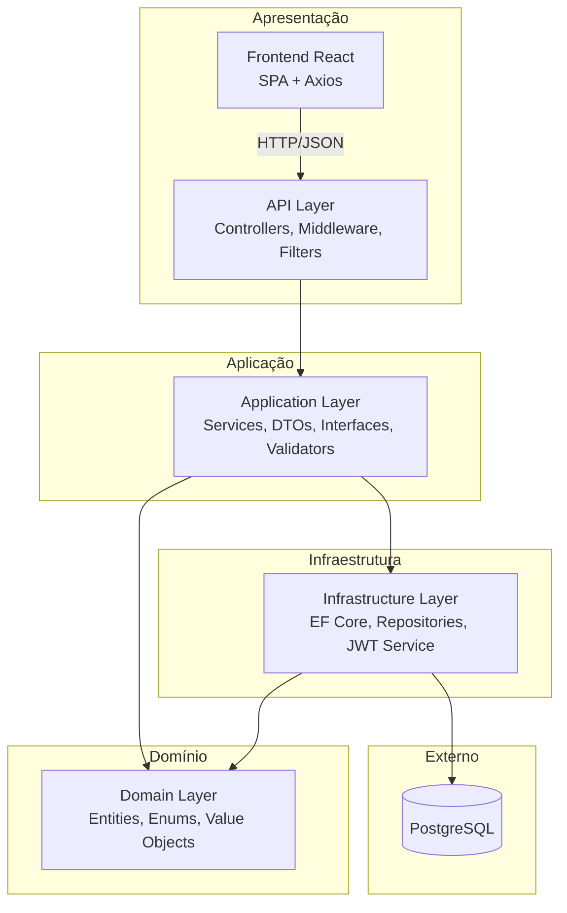
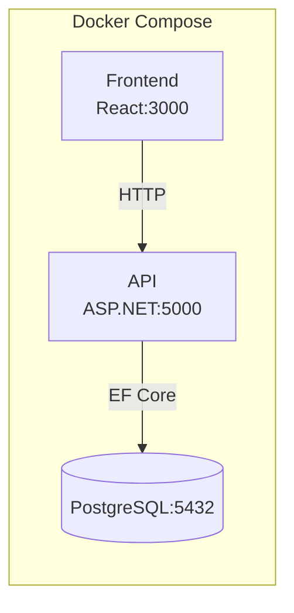
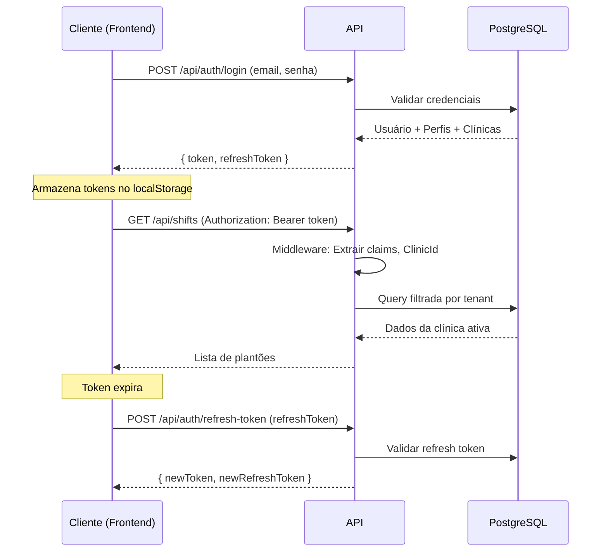
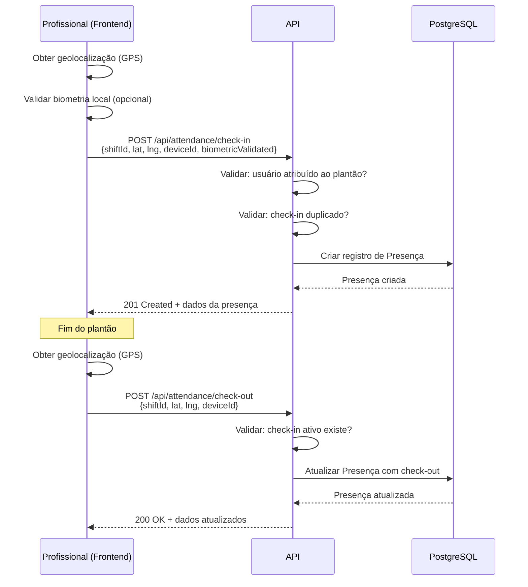
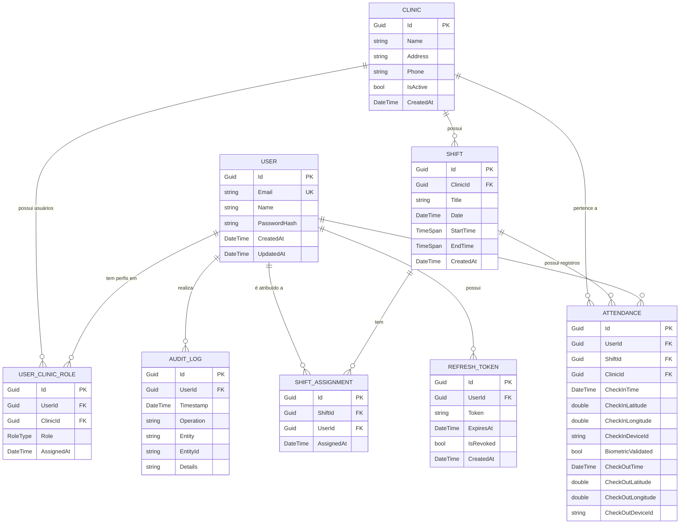

# Documento de Design - PlantonHub MVP

## Visão Geral

O PlantonHub MVP é um sistema de gestão de plantões médicos que permite a profissionais de saúde gerenciarem suas escalas, registrarem presença (check-in/check-out com geolocalização) e manterem histórico de suas atividades. O sistema é multi-tenant por clínica, com controle de acesso baseado em papéis (RBAC) e autenticação JWT.

### Decisões Arquiteturais Chave

| Decisão | Escolha | Justificativa |
|---------|---------|---------------|
| Arquitetura | Clean Architecture (4 camadas) | Separação de responsabilidades, testabilidade, manutenibilidade |
| Backend | .NET 8 + ASP.NET Core Web API | Performance, ecossistema maduro, suporte LTS |
| ORM | Entity Framework Core | Integração nativa com .NET, migrations, LINQ |
| Banco de Dados | PostgreSQL | Open source, robusto, suporte a JSON, extensível |
| Frontend | React + TypeScript | Componentização, tipagem estática, ecossistema vasto |
| Autenticação | JWT + Refresh Token | Stateless, escalável, padrão de mercado |
| Multi-tenancy | Filtro por ClinicId via middleware | Simples para MVP, não requer schemas separados |
| Containerização | Docker + docker-compose | Ambiente reproduzível, deploy simplificado |

## Arquitetura

### Diagrama de Camadas (Clean Architecture)



### Diagrama de Implantação



### Fluxo de Autenticação



### Fluxo de Check-in/Check-out



## Componentes e Interfaces

### Camada Domain

```
Domain/
├── Entities/
│   ├── User.cs              # Usuário do sistema
│   ├── Clinic.cs            # Clínica (Tenant)
│   ├── UserClinicRole.cs    # Vínculo Usuário-Clínica-Perfil
│   ├── Shift.cs             # Plantão
│   ├── ShiftAssignment.cs   # Atribuição de profissional a plantão
│   ├── Attendance.cs        # Registro de presença (check-in/check-out)
│   └── AuditLog.cs          # Log de auditoria
├── Enums/
│   └── RoleType.cs          # AdminGlobal, AdminClinica, Medico, Enfermeiro, Tecnico
└── Interfaces/
    ├── IUserRepository.cs
    ├── IClinicRepository.cs
    ├── IShiftRepository.cs
    ├── IAttendanceRepository.cs
    └── IAuditLogRepository.cs
```

### Camada Application

```
Application/
├── Services/
│   ├── AuthService.cs           # Login, refresh token
│   ├── ClinicService.cs         # CRUD de clínicas
│   ├── UserService.cs           # CRUD de usuários, atribuição de perfis
│   ├── ShiftService.cs          # CRUD de plantões, atribuição de profissionais
│   ├── AttendanceService.cs     # Check-in, check-out, histórico
│   └── AuditService.cs          # Registro e consulta de auditoria
├── DTOs/
│   ├── Auth/
│   │   ├── LoginRequest.cs
│   │   ├── LoginResponse.cs
│   │   ├── RefreshTokenRequest.cs
│   │   └── RefreshTokenResponse.cs
│   ├── Clinics/
│   │   ├── CreateClinicRequest.cs
│   │   └── ClinicResponse.cs
│   ├── Users/
│   │   ├── CreateUserRequest.cs
│   │   ├── AssignRoleRequest.cs
│   │   └── UserResponse.cs
│   ├── Shifts/
│   │   ├── CreateShiftRequest.cs
│   │   ├── AssignShiftRequest.cs
│   │   └── ShiftResponse.cs
│   └── Attendance/
│       ├── CheckInRequest.cs
│       ├── CheckOutRequest.cs
│       └── AttendanceResponse.cs
├── Interfaces/
│   ├── IAuthService.cs
│   ├── IClinicService.cs
│   ├── IUserService.cs
│   ├── IShiftService.cs
│   ├── IAttendanceService.cs
│   └── IAuditService.cs
└── Validators/
    ├── LoginRequestValidator.cs
    ├── CreateClinicRequestValidator.cs
    ├── CreateUserRequestValidator.cs
    ├── CreateShiftRequestValidator.cs
    ├── CheckInRequestValidator.cs
    └── CheckOutRequestValidator.cs
```

### Camada Infrastructure

```
Infrastructure/
├── Data/
│   ├── AppDbContext.cs              # DbContext com configuração multi-tenant
│   ├── Configurations/
│   │   ├── UserConfiguration.cs
│   │   ├── ClinicConfiguration.cs
│   │   ├── UserClinicRoleConfiguration.cs
│   │   ├── ShiftConfiguration.cs
│   │   ├── ShiftAssignmentConfiguration.cs
│   │   ├── AttendanceConfiguration.cs
│   │   └── AuditLogConfiguration.cs
│   └── Migrations/
├── Repositories/
│   ├── UserRepository.cs
│   ├── ClinicRepository.cs
│   ├── ShiftRepository.cs
│   ├── AttendanceRepository.cs
│   └── AuditLogRepository.cs
├── Services/
│   ├── JwtTokenService.cs           # Geração e validação de JWT
│   ├── PasswordHashService.cs       # Hash e verificação de senha
│   └── TenantService.cs             # Resolução do tenant ativo
└── Seed/
    └── DatabaseSeeder.cs            # Seed inicial (admin, clínicas, usuários teste)
```

### Camada API

```
API/
├── Controllers/
│   ├── AuthController.cs
│   ├── ClinicsController.cs
│   ├── UsersController.cs
│   ├── ShiftsController.cs
│   ├── AttendanceController.cs
│   └── AuditController.cs
├── Middleware/
│   ├── TenantMiddleware.cs          # Extrai ClinicId do JWT e injeta no contexto
│   ├── AuditMiddleware.cs           # Intercepta operações para auditoria
│   └── ExceptionHandlingMiddleware.cs
├── Filters/
│   └── ValidationFilter.cs
├── Program.cs
├── Dockerfile
└── appsettings.json
```

### Camada Frontend

```
frontend/
├── src/
│   ├── api/
│   │   ├── axiosInstance.ts         # Axios com interceptors (JWT, refresh)
│   │   ├── authApi.ts
│   │   ├── clinicsApi.ts
│   │   ├── usersApi.ts
│   │   ├── shiftsApi.ts
│   │   └── attendanceApi.ts
│   ├── contexts/
│   │   ├── AuthContext.tsx          # Estado de autenticação
│   │   └── ClinicContext.tsx        # Clínica ativa selecionada
│   ├── pages/
│   │   ├── LoginPage.tsx
│   │   ├── DashboardPage.tsx
│   │   ├── ShiftsPage.tsx
│   │   ├── AttendancePage.tsx
│   │   ├── ClinicsPage.tsx
│   │   └── UsersPage.tsx
│   ├── components/
│   │   ├── ClinicSelector.tsx
│   │   ├── CheckInButton.tsx
│   │   ├── CheckOutButton.tsx
│   │   ├── ShiftList.tsx
│   │   └── ProtectedRoute.tsx
│   ├── hooks/
│   │   ├── useAuth.ts
│   │   ├── useGeolocation.ts
│   │   └── useClinic.ts
│   └── types/
│       └── index.ts
├── package.json
└── Dockerfile
```

### Interfaces Principais (Contratos da API)

#### AuthController

| Método | Endpoint | Request | Response | Auth |
|--------|----------|---------|----------|------|
| POST | /api/auth/login | `{ email, password }` | `{ token, refreshToken }` | Público |
| POST | /api/auth/refresh-token | `{ refreshToken }` | `{ token, refreshToken }` | Público |

#### ClinicsController

| Método | Endpoint | Request | Response | Auth |
|--------|----------|---------|----------|------|
| GET | /api/clinics | - | `Clinic[]` | AdminGlobal, AdminClinica |
| POST | /api/clinics | `{ name, address, ... }` | `Clinic` | AdminGlobal |

#### UsersController

| Método | Endpoint | Request | Response | Auth |
|--------|----------|---------|----------|------|
| GET | /api/users | - | `User[]` | AdminGlobal |
| POST | /api/users | `{ email, name, password }` | `User` | AdminGlobal |
| POST | /api/users/{id}/clinic-role | `{ clinicId, role }` | `UserClinicRole` | AdminGlobal |

#### ShiftsController

| Método | Endpoint | Request | Response | Auth |
|--------|----------|---------|----------|------|
| GET | /api/shifts | - | `Shift[]` | Todos (filtrado) |
| POST | /api/shifts | `{ title, date, startTime, endTime }` | `Shift` | AdminClinica |
| POST | /api/shifts/{id}/assign | `{ userId }` | `ShiftAssignment` | AdminClinica |

#### AttendanceController

| Método | Endpoint | Request | Response | Auth |
|--------|----------|---------|----------|------|
| POST | /api/attendance/check-in | `{ shiftId, lat, lng, deviceId, biometricValidated }` | `Attendance` | Medico, Enfermeiro, Tecnico |
| POST | /api/attendance/check-out | `{ shiftId, lat, lng, deviceId }` | `Attendance` | Medico, Enfermeiro, Tecnico |
| GET | /api/attendance/my-history | - | `Attendance[]` | Medico, Enfermeiro, Tecnico |

#### AuditController

| Método | Endpoint | Request | Response | Auth |
|--------|----------|---------|----------|------|
| GET | /api/audit | - | `AuditLog[]` | AdminGlobal |

## Modelos de Dados

### Diagrama ER



### Entidades Detalhadas

#### User
| Campo | Tipo | Restrições |
|-------|------|-----------|
| Id | Guid | PK, auto-gerado |
| Email | string | Unique, Required, max 256 |
| Name | string | Required, max 200 |
| PasswordHash | string | Required |
| CreatedAt | DateTime | UTC |
| UpdatedAt | DateTime | UTC |

#### Clinic
| Campo | Tipo | Restrições |
|-------|------|-----------|
| Id | Guid | PK, auto-gerado |
| Name | string | Required, max 200 |
| Address | string | max 500 |
| Phone | string | max 20 |
| IsActive | bool | Default true |
| CreatedAt | DateTime | UTC |

#### UserClinicRole
| Campo | Tipo | Restrições |
|-------|------|-----------|
| Id | Guid | PK, auto-gerado |
| UserId | Guid | FK → User |
| ClinicId | Guid | FK → Clinic |
| Role | RoleType | Enum |
| AssignedAt | DateTime | UTC |
| | | Unique(UserId, ClinicId, Role) |

#### Shift
| Campo | Tipo | Restrições |
|-------|------|-----------|
| Id | Guid | PK, auto-gerado |
| ClinicId | Guid | FK → Clinic |
| Title | string | Required, max 200 |
| Date | DateTime | Required |
| StartTime | TimeSpan | Required |
| EndTime | TimeSpan | Required |
| CreatedAt | DateTime | UTC |

#### ShiftAssignment
| Campo | Tipo | Restrições |
|-------|------|-----------|
| Id | Guid | PK, auto-gerado |
| ShiftId | Guid | FK → Shift |
| UserId | Guid | FK → User |
| AssignedAt | DateTime | UTC |
| | | Unique(ShiftId, UserId) |

#### Attendance
| Campo | Tipo | Restrições |
|-------|------|-----------|
| Id | Guid | PK, auto-gerado |
| UserId | Guid | FK → User |
| ShiftId | Guid | FK → Shift |
| ClinicId | Guid | FK → Clinic |
| CheckInTime | DateTime | Required, UTC |
| CheckInLatitude | double | Required |
| CheckInLongitude | double | Required |
| CheckInDeviceId | string | Required, max 100 |
| BiometricValidated | bool | Default false |
| CheckOutTime | DateTime? | Nullable, UTC |
| CheckOutLatitude | double? | Nullable |
| CheckOutLongitude | double? | Nullable |
| CheckOutDeviceId | string? | Nullable, max 100 |

#### AuditLog
| Campo | Tipo | Restrições |
|-------|------|-----------|
| Id | Guid | PK, auto-gerado |
| UserId | Guid | FK → User |
| Timestamp | DateTime | Required, UTC |
| Operation | string | Required (Create/Update/Delete) |
| Entity | string | Required (nome da entidade) |
| EntityId | string | Required |
| Details | string | JSON com dados da operação |

#### RefreshToken
| Campo | Tipo | Restrições |
|-------|------|-----------|
| Id | Guid | PK, auto-gerado |
| UserId | Guid | FK → User |
| Token | string | Required, Unique |
| ExpiresAt | DateTime | Required, UTC |
| IsRevoked | bool | Default false |
| CreatedAt | DateTime | UTC |

### RoleType Enum
```csharp
public enum RoleType
{
    AdminGlobal = 1,
    AdminClinica = 2,
    Medico = 3,
    Enfermeiro = 4,
    Tecnico = 5
}
```

## Propriedades de Corretude

*Uma propriedade é uma característica ou comportamento que deve ser verdadeiro em todas as execuções válidas de um sistema — essencialmente, uma declaração formal sobre o que o sistema deve fazer. Propriedades servem como ponte entre especificações legíveis por humanos e garantias de corretude verificáveis por máquina.*

### Propriedade 1: Claims do JWT contêm dados corretos do usuário

*Para qualquer* usuário válido com qualquer combinação de perfis e clínicas, ao realizar login com credenciais válidas, o Token_JWT gerado SHALL conter claims de UserId correspondendo ao usuário, lista completa de perfis (roles) do usuário e ClinicId do contexto ativo.

**Validates: Requirements 1.1, 1.5**

### Propriedade 2: Credenciais e tokens inválidos são rejeitados

*Para qualquer* combinação de credenciais inválidas (email inexistente, senha incorreta) ou refresh tokens inválidos/expirados, a API SHALL retornar HTTP 401 Unauthorized sem revelar qual campo está incorreto.

**Validates: Requirements 1.2, 1.4**

### Propriedade 3: Refresh token preserva claims (round-trip)

*Para qualquer* usuário autenticado com um refresh token válido, ao submeter o refresh token, o novo Token_JWT gerado SHALL conter os mesmos claims (UserId, roles, ClinicId) que o token original.

**Validates: Requirements 1.3**

### Propriedade 4: AdminGlobal possui acesso irrestrito a todos os dados

*Para qualquer* usuário com perfil AdminGlobal e qualquer conjunto de dados distribuídos em múltiplas clínicas, ao realizar consultas, a API SHALL retornar todos os registros de todas as clínicas sem filtro de tenant.

**Validates: Requirements 2.3, 3.3, 4.1, 5.1, 6.5**

### Propriedade 5: Isolamento de tenant para usuários não-globais

*Para qualquer* usuário com perfil AdminClinica, Medico, Enfermeiro ou Tecnico vinculado a uma clínica específica, todas as consultas SHALL retornar apenas dados pertencentes à clínica ativa no contexto do token, sem jamais incluir dados de outras clínicas.

**Validates: Requirements 2.4, 3.1, 3.2, 4.3, 6.3**

### Propriedade 6: Profissionais visualizam apenas plantões atribuídos

*Para qualquer* profissional (Medico, Enfermeiro ou Tecnico) com atribuições a um subconjunto de plantões de uma clínica, ao consultar plantões, a API SHALL retornar exclusivamente os plantões aos quais o profissional está atribuído.

**Validates: Requirements 2.5, 6.4**

### Propriedade 7: Acesso não autorizado retorna 403 Forbidden

*Para qualquer* usuário tentando realizar uma operação para a qual não possui permissão (criar clínica sem ser AdminGlobal, acessar clínica sem vínculo, criar usuário sem ser AdminGlobal, check-in/check-out em plantão não atribuído, acessar auditoria sem ser AdminGlobal), a API SHALL retornar HTTP 403 Forbidden.

**Validates: Requirements 3.4, 4.4, 5.4, 6.6, 7.3, 8.4, 10.3**

### Propriedade 8: Usuário suporta múltiplos perfis em múltiplas clínicas

*Para qualquer* usuário com N perfis distribuídos em M clínicas, o sistema SHALL persistir e retornar corretamente todas as N associações UserClinicRole, permitindo que o usuário atue em qualquer uma das clínicas com o perfil correspondente.

**Validates: Requirements 2.2, 5.3**

### Propriedade 9: Dados inválidos são rejeitados com detalhes de validação

*Para qualquer* requisição de criação de usuário com dados inválidos (email duplicado, campos obrigatórios ausentes, formato de email inválido), a API SHALL retornar HTTP 400 Bad Request com detalhes específicos dos erros de validação.

**Validates: Requirements 5.5**

### Propriedade 10: Check-in persiste registro completo de presença (round-trip)

*Para qualquer* check-in válido com dados de geolocalização (latitude, longitude), deviceId e flag biométrica, o registro de presença criado SHALL conter todos os campos submetidos, e ao consultar o histórico, os mesmos dados SHALL ser retornados integralmente.

**Validates: Requirements 7.1, 9.2**

### Propriedade 11: Check-in duplicado é prevenido

*Para qualquer* plantão que já possui um check-in ativo (sem check-out correspondente), uma tentativa de segundo check-in pelo mesmo profissional SHALL ser rejeitada com HTTP 409 Conflict, mantendo o registro original intacto.

**Validates: Requirements 7.4**

### Propriedade 12: Check-out atualiza registro existente

*Para qualquer* presença com check-in ativo, ao realizar check-out com dados válidos (latitude, longitude, deviceId), o registro SHALL ser atualizado com os dados de saída sem alterar os dados de check-in originais.

**Validates: Requirements 8.1**

### Propriedade 13: Check-out requer check-in ativo

*Para qualquer* tentativa de check-out em um plantão sem check-in ativo correspondente, a API SHALL retornar HTTP 400 Bad Request indicando a ausência de check-in.

**Validates: Requirements 8.3**

### Propriedade 14: Histórico é ordenado por data decrescente

*Para qualquer* conjunto de registros de presença ou auditoria, ao consultar o histórico, os resultados SHALL ser retornados em ordem decrescente de data/hora, garantindo que os registros mais recentes apareçam primeiro.

**Validates: Requirements 9.1, 10.2**

### Propriedade 15: Operações CUD geram registro de auditoria

*Para qualquer* operação de criação, atualização ou exclusão realizada no sistema, o sistema SHALL criar um registro em AuditLog contendo UserId do autor, DateTime, tipo de operação, entidade afetada e dados relevantes da operação.

**Validates: Requirements 10.1**

## Tratamento de Erros

### Estratégia Global

O sistema utiliza um middleware centralizado de tratamento de exceções (`ExceptionHandlingMiddleware`) que intercepta todas as exceções não tratadas e as converte em respostas HTTP padronizadas.

### Códigos de Resposta

| Código | Cenário | Resposta |
|--------|---------|----------|
| 200 | Operação bem-sucedida (atualização) | Dados atualizados |
| 201 | Recurso criado com sucesso | Dados do recurso criado |
| 400 | Dados inválidos / Regra de negócio violada | `{ errors: { campo: [mensagens] } }` |
| 401 | Credenciais inválidas / Token expirado | `{ message: "Unauthorized" }` |
| 403 | Sem permissão para a operação | `{ message: "Forbidden" }` |
| 404 | Recurso não encontrado | `{ message: "Not found" }` |
| 409 | Conflito (check-in duplicado) | `{ message: "Conflict", detail: "..." }` |
| 500 | Erro interno do servidor | `{ message: "Internal Server Error" }` |

### Formato de Erro Padrão

```json
{
  "type": "https://tools.ietf.org/html/rfc7807",
  "title": "Validation Error",
  "status": 400,
  "detail": "One or more validation errors occurred.",
  "errors": {
    "email": ["O campo email é obrigatório."],
    "password": ["A senha deve ter no mínimo 8 caracteres."]
  }
}
```

### Exceções de Domínio

| Exceção | HTTP Code | Quando |
|---------|-----------|--------|
| InvalidCredentialsException | 401 | Login com credenciais inválidas |
| UnauthorizedException | 401 | Token JWT inválido ou expirado |
| ForbiddenException | 403 | Acesso negado por RBAC ou tenant |
| NotFoundException | 404 | Entidade não encontrada |
| ConflictException | 409 | Check-in duplicado |
| ValidationException | 400 | Dados de entrada inválidos |

### Validação com FluentValidation

- Validação de DTOs de entrada é feita na camada Application usando FluentValidation
- Erros de validação são capturados pelo `ValidationFilter` e retornados como 400
- Mensagens de erro são descritivas e em português

## Estratégia de Testes

### Abordagem Dual de Testes

O projeto utiliza uma combinação de testes unitários (exemplos específicos) e testes baseados em propriedades (verificação universal) para cobertura abrangente.

### Testes Baseados em Propriedades (PBT)

**Biblioteca:** [FsCheck.xUnit](https://github.com/fscheck/FsCheck) (integrado com xUnit)

**Configuração:**
- Mínimo de 100 iterações por teste de propriedade
- Cada teste referencia a propriedade do documento de design
- Formato de tag: `Feature: plantonhub-mvp, Property {número}: {texto da propriedade}`

**Propriedades a implementar:**
- Propriedades 1-3: Testes na camada de serviço de autenticação (JwtTokenService, AuthService)
- Propriedades 4-7: Testes na camada de autorização e middleware de tenant
- Propriedades 8-9: Testes na camada de serviço de usuários
- Propriedades 10-13: Testes na camada de serviço de presença (AttendanceService)
- Propriedades 14-15: Testes na camada de consulta de histórico e auditoria

### Testes Unitários

**Framework:** xUnit + Moq + FluentAssertions

**Cobertura:**
- Validadores (FluentValidation): exemplos de inputs válidos e inválidos
- Serviços de aplicação: lógica de negócio com mocks de repositórios
- Middleware de tenant: extração correta de claims
- Controllers: mapeamento de exceções para HTTP codes

### Testes de Integração

**Framework:** xUnit + WebApplicationFactory + Testcontainers (PostgreSQL)

**Cobertura:**
- Fluxo completo de autenticação (login → token → acesso → refresh)
- CRUD de entidades com banco real
- Isolamento de tenant end-to-end
- Seed de dados e migrations

### Testes de Frontend

**Framework:** Vitest + React Testing Library

**Cobertura:**
- Componentes: renderização condicional por perfil
- Hooks: useAuth, useGeolocation, useClinic
- API interceptors: refresh automático de token
- Páginas: fluxos de check-in/check-out

### Estrutura de Projetos de Teste

```
tests/
├── PlantonHub.UnitTests/
│   ├── Services/
│   ├── Validators/
│   └── Middleware/
├── PlantonHub.PropertyTests/
│   ├── Auth/
│   ├── Authorization/
│   ├── Tenant/
│   └── Attendance/
└── PlantonHub.IntegrationTests/
    ├── Controllers/
    └── Flows/
```

