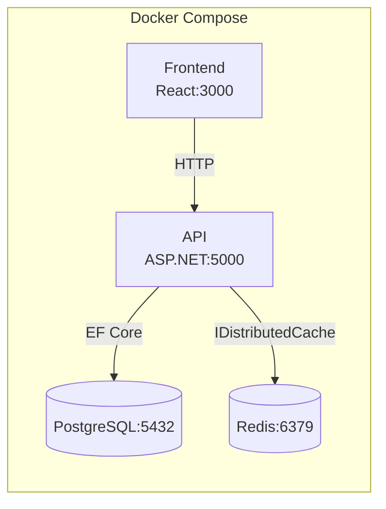
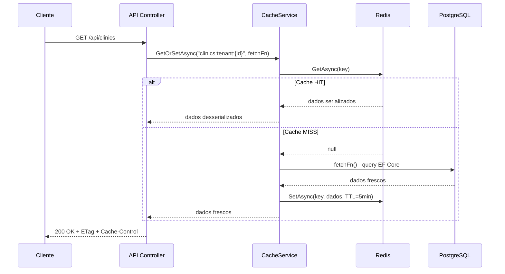
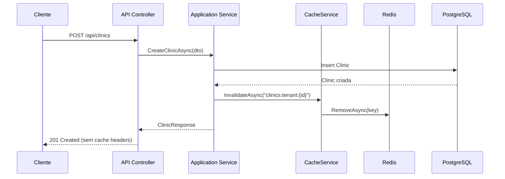
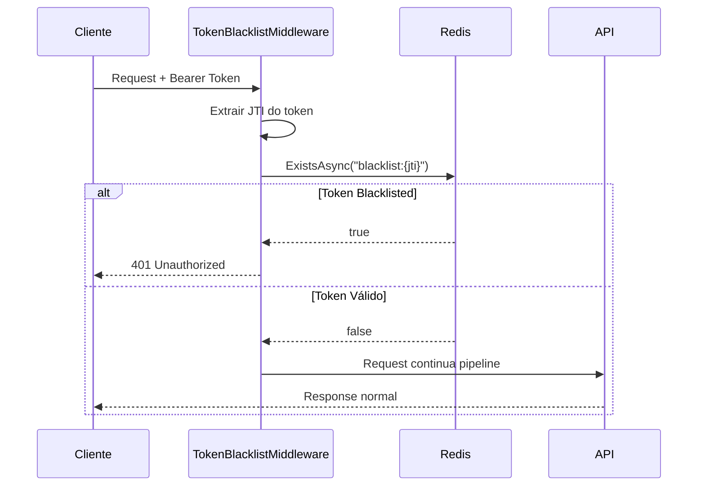
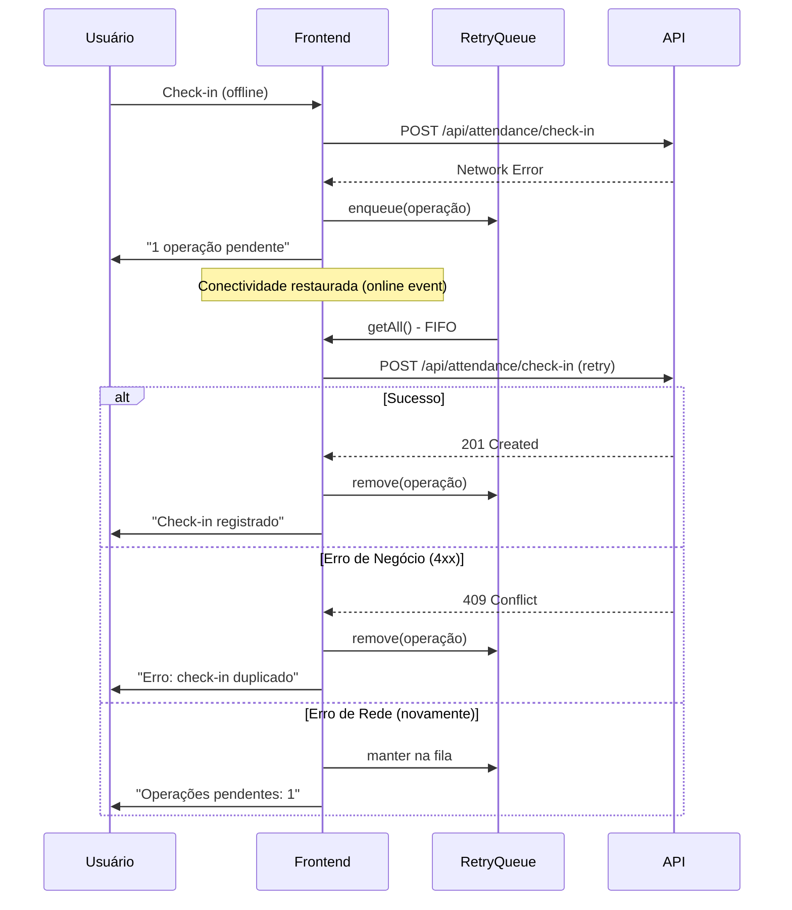

# Documento de Design - Redis Cache Layer

## Visão Geral

Este documento descreve a arquitetura e os componentes da camada de cache distribuído Redis para o PlantonHub. A implementação segue o padrão **cache-aside** (lazy-loading) com invalidação explícita em operações de escrita, integrando-se à Clean Architecture existente sem acoplamento direto ao provider Redis.

### Decisões Arquiteturais Chave

| Decisão | Escolha | Justificativa |
|---------|---------|---------------|
| Cache Provider | Redis 7 (Alpine) | Leve, performático, suporte a TTL nativo, persistência opcional |
| Interface .NET | `IDistributedCache` | Abstração nativa do .NET, agnóstica ao provider, testável |
| Abstração Custom | `ICacheService` na camada Application | Encapsula lógica de serialização, prefixos e fallback |
| Padrão de Cache | Cache-Aside (Lazy Loading) | Simples, previsível, sem stale data após write |
| Invalidação | Explícita em operações de escrita | Garante consistência — dados nunca ficam stale após mutação |
| Token Blacklist | Redis SET com TTL por entrada | Verificação O(1), auto-expiração, sem limpeza manual |
| Response Cache | ETag + Cache-Control headers | Cache condicional HTTP reduz payload sem comprometer freshness |
| Retry Queue | Array em memória (vanilla JS) | Sem dependência de framework, persistência desnecessária para operações curtas |
| Serialização | System.Text.Json | Nativo do .NET 8, performático, sem dependência extra |

## Arquitetura

### Diagrama de Implantação Atualizado



### Fluxo Cache-Aside (Leitura)



### Fluxo de Invalidação (Escrita)



### Fluxo de Token Blacklist



### Fluxo de Retry Queue (Frontend)



## Componentes e Interfaces

### Camada Application — Interface `ICacheService`

```csharp
namespace PlantonHub.Application.Interfaces;

public interface ICacheService
{
    /// <summary>
    /// Busca valor do cache ou executa factory e armazena resultado.
    /// </summary>
    Task<T?> GetOrSetAsync<T>(string key, Func<Task<T>> factory, TimeSpan? ttl = null, CancellationToken ct = default);

    /// <summary>
    /// Busca valor do cache. Retorna null se não encontrado.
    /// </summary>
    Task<T?> GetAsync<T>(string key, CancellationToken ct = default);

    /// <summary>
    /// Armazena valor no cache com TTL.
    /// </summary>
    Task SetAsync<T>(string key, T value, TimeSpan? ttl = null, CancellationToken ct = default);

    /// <summary>
    /// Remove uma entrada do cache (invalidação).
    /// </summary>
    Task RemoveAsync(string key, CancellationToken ct = default);

    /// <summary>
    /// Remove todas as entradas que correspondem a um padrão de chave.
    /// </summary>
    Task RemoveByPrefixAsync(string prefix, CancellationToken ct = default);
}
```

### Camada Application — Interface `ITokenBlacklistService`

```csharp
namespace PlantonHub.Application.Interfaces;

public interface ITokenBlacklistService
{
    /// <summary>
    /// Adiciona um token à blacklist com TTL baseado na expiração do token.
    /// </summary>
    Task BlacklistTokenAsync(string jti, TimeSpan remainingTtl, CancellationToken ct = default);

    /// <summary>
    /// Verifica se um token está na blacklist.
    /// </summary>
    Task<bool> IsBlacklistedAsync(string jti, CancellationToken ct = default);
}
```

### Camada Infrastructure — Implementações

```
Infrastructure/
├── Cache/
│   ├── RedisCacheService.cs          # Implementação de ICacheService via IDistributedCache
│   ├── RedisTokenBlacklistService.cs # Implementação de ITokenBlacklistService
│   └── CacheKeys.cs                  # Constantes e factory de chaves de cache
└── ...
```

#### `RedisCacheService` — Responsabilidades

- Serializa/desserializa objetos com `System.Text.Json`
- Aplica prefixo configurável em todas as chaves
- Gerencia TTL padrão (5 minutos) com override por chamada
- Swallows exceptions do Redis em operações de read (fallback graceful)
- Loga warnings quando Redis indisponível em operações de write
- Implementa `RemoveByPrefixAsync` via SCAN do Redis (para invalidação por padrão)

#### `CacheKeys` — Geração de Chaves

```csharp
namespace PlantonHub.Infrastructure.Cache;

public static class CacheKeys
{
    private static string _prefix = "plantonhub";

    public static void SetPrefix(string prefix) => _prefix = prefix;

    public static string Clinics(Guid clinicId) => $"{_prefix}:clinics:tenant:{clinicId}";
    public static string ClinicsAll() => $"{_prefix}:clinics:all";
    public static string Shifts(Guid clinicId) => $"{_prefix}:shifts:tenant:{clinicId}";
    public static string ShiftsUser(Guid clinicId, Guid userId) => $"{_prefix}:shifts:tenant:{clinicId}:user:{userId}";
    public static string UserProfile(Guid userId) => $"{_prefix}:users:profile:{userId}";
    public static string TokenBlacklist(string jti) => $"{_prefix}:blacklist:{jti}";
}
```

### Camada API — Middleware e Filtros

#### `TokenBlacklistMiddleware`

```csharp
namespace PlantonHub.API.Middleware;

/// <summary>
/// Middleware que intercepta requisições autenticadas e verifica
/// se o token JWT está na blacklist antes de prosseguir.
/// </summary>
public class TokenBlacklistMiddleware
{
    // Executa após Authentication, antes de Authorization
    // Extrai JTI claim do token
    // Consulta ITokenBlacklistService
    // Retorna 401 se blacklisted
}
```

#### `ETagActionFilter`

```csharp
namespace PlantonHub.API.Filters;

/// <summary>
/// Action filter que:
/// - Calcula ETag (SHA256 hash do body) para respostas GET
/// - Compara com If-None-Match e retorna 304 se match
/// - Adiciona headers Cache-Control: private, max-age=60 em GETs de listagem
/// - Não adiciona cache headers em respostas de escrita (POST/PUT/DELETE)
/// </summary>
public class ETagActionFilter : IAsyncActionFilter
{
    // Lógica:
    // 1. Executa action normalmente
    // 2. Se GET: calcula SHA256 do body serializado
    // 3. Se If-None-Match == ETag calculado: retorna 304
    // 4. Caso contrário: adiciona ETag + Cache-Control ao response
}
```

### Camada API — Endpoint de Logout

```csharp
// Novo endpoint no AuthController
[HttpPost("logout")]
[Authorize]
public async Task<IActionResult> Logout()
{
    // 1. Extrair JTI do token atual (claim "jti")
    // 2. Calcular tempo restante até expiração (claim "exp")
    // 3. Chamar ITokenBlacklistService.BlacklistTokenAsync(jti, remainingTtl)
    // 4. Retornar 204 No Content
}
```

### Camada Frontend — Retry Queue (Vanilla JS)

```
frontend/public/
├── js/
│   └── retryQueue.js     # Módulo de fila de retry (IIFE ou ES module)
```

#### Interface da Retry Queue

```javascript
// retryQueue.js - API pública
const RetryQueue = {
    MAX_SIZE: 20,

    /**
     * Adiciona operação à fila. Retorna false se fila cheia.
     * @param {{ type: 'check-in'|'check-out', payload: object, timestamp: number }} operation
     */
    enqueue(operation) { /* ... */ },

    /**
     * Remove operação da fila por ID.
     */
    dequeue(operationId) { /* ... */ },

    /**
     * Retorna todas as operações pendentes (FIFO order).
     */
    getAll() { /* ... */ },

    /**
     * Retorna número de operações pendentes.
     */
    size() { /* ... */ },

    /**
     * Tenta reenviar todas as operações pendentes.
     * Remove operações com sucesso ou erro 4xx.
     * Mantém operações com erro de rede.
     */
    async flush(sendFn) { /* ... */ },
};

// Registra listener de conectividade
window.addEventListener('online', () => RetryQueue.flush(sendOperation));
```

### Configuração no `Program.cs` — Adições

```csharp
// ----- Redis / Distributed Cache -----
builder.Services.AddStackExchangeRedisCache(options =>
{
    options.Configuration = builder.Configuration.GetConnectionString("Redis");
    options.InstanceName = builder.Configuration["CacheSettings:InstancePrefix"] ?? "plantonhub:";
});

// ----- Cache Services -----
builder.Services.AddScoped<ICacheService, RedisCacheService>();
builder.Services.AddScoped<ITokenBlacklistService, RedisTokenBlacklistService>();

// ----- Middleware Pipeline (após Authentication) -----
app.UseAuthentication();
app.UseMiddleware<TokenBlacklistMiddleware>(); // NOVO: após auth, antes de authorization
app.UseAuthorization();
```

### Configuração no `docker-compose.yml` — Adições

```yaml
services:
  redis:
    image: redis:7-alpine
    container_name: plantonhub-redis
    ports:
      - "6379:6379"
    volumes:
      - redis_data:/data
    healthcheck:
      test: ["CMD", "redis-cli", "ping"]
      interval: 5s
      timeout: 3s
      retries: 5
    restart: unless-stopped

  api:
    # ... existing config ...
    environment:
      - ConnectionStrings__Redis=plantonhub-redis:6379
      - CacheSettings__InstancePrefix=plantonhub:
      - CacheSettings__DefaultTtlMinutes=5
    depends_on:
      db:
        condition: service_healthy
      redis:
        condition: service_healthy

volumes:
  postgres_data:
  redis_data:
```

### Configuração em `appsettings.json` — Adições

```json
{
  "ConnectionStrings": {
    "DefaultConnection": "...",
    "Redis": "localhost:6379"
  },
  "CacheSettings": {
    "InstancePrefix": "plantonhub:",
    "DefaultTtlMinutes": 5
  }
}
```

## Modelos de Dados

### Estrutura de Dados no Redis

O Redis armazena dados em formato chave-valor. Abaixo estão os padrões de chaves e tipos de dados utilizados:

| Chave | Tipo Redis | Conteúdo | TTL |
|-------|-----------|----------|-----|
| `plantonhub:clinics:all` | STRING | JSON serializado da lista de clínicas (AdminGlobal) | 5 min |
| `plantonhub:clinics:tenant:{clinicId}` | STRING | JSON serializado da clínica específica | 5 min |
| `plantonhub:shifts:tenant:{clinicId}` | STRING | JSON serializado da lista de plantões da clínica | 5 min |
| `plantonhub:shifts:tenant:{clinicId}:user:{userId}` | STRING | JSON serializado dos plantões do usuário | 5 min |
| `plantonhub:users:profile:{userId}` | STRING | JSON serializado do perfil + roles do usuário | 5 min |
| `plantonhub:blacklist:{jti}` | STRING | "1" (flag de existência) | Tempo restante do token |

### Modelo da Operação na Retry Queue (Frontend)

```typescript
interface QueuedOperation {
    id: string;              // UUID gerado no momento do enqueue
    type: 'check-in' | 'check-out';
    payload: {
        shiftId: string;
        lat: number;
        lng: number;
        deviceId: string;
        biometricValidated?: boolean;  // apenas check-in
    };
    timestamp: number;       // Date.now() do momento da falha
    retryCount: number;      // contador de tentativas
}
```

### Configuração `CacheSettings`

```csharp
namespace PlantonHub.Infrastructure.Cache;

public class CacheSettings
{
    public string InstancePrefix { get; set; } = "plantonhub:";
    public int DefaultTtlMinutes { get; set; } = 5;
}
```

## Propriedades de Corretude

*Uma propriedade é uma característica ou comportamento que deve ser verdadeiro em todas as execuções válidas de um sistema — essencialmente, uma declaração formal sobre o que o sistema deve fazer. Propriedades servem como ponte entre especificações legíveis por humanos e garantias de corretude verificáveis por máquina.*

### Propriedade 1: Chaves de cache incluem prefixo e escopo correto

*Para qualquer* operação de cache em qualquer entidade (clínicas, plantões, perfis), a chave gerada SHALL sempre começar com o prefixo configurado e incluir os identificadores de escopo relevantes (ClinicId para dados tenant-scoped, UserId para dados user-scoped).

**Validates: Requirements 2.3, 3.4, 4.4, 5.4**

### Propriedade 2: Cache-aside retorna dados do cache quando disponíveis

*Para qualquer* recurso cacheável que já está armazenado no Redis, uma requisição GET subsequente SHALL retornar os dados do cache sem consultar o banco de dados PostgreSQL.

**Validates: Requirements 3.1, 4.1, 5.1**

### Propriedade 3: Cache miss popula o cache com TTL correto

*Para qualquer* recurso cacheável que não está no Redis (cache miss), após buscar os dados do banco de dados, o sistema SHALL armazenar o resultado no cache com TTL igual ao valor configurado (padrão: 5 minutos).

**Validates: Requirements 3.2, 4.2, 5.2**

### Propriedade 4: Operações de escrita invalidam entradas de cache relacionadas

*Para qualquer* operação de criação, atualização ou exclusão em uma entidade cacheável (clínica, plantão, perfil de usuário), o sistema SHALL remover do cache todas as entradas correspondentes àquela entidade e escopo, garantindo que leituras subsequentes busquem dados frescos do banco.

**Validates: Requirements 3.3, 4.3, 5.3**

### Propriedade 5: ETag round-trip retorna 304 quando dados inalterados

*Para qualquer* resposta GET em endpoints cacheáveis que produz um ETag, uma requisição subsequente com header `If-None-Match` contendo o mesmo ETag, se os dados não foram alterados, SHALL resultar em HTTP 304 Not Modified sem corpo de resposta.

**Validates: Requirements 6.2**

### Propriedade 6: Headers de cache presentes apenas em respostas GET

*Para qualquer* resposta HTTP do sistema, os headers `ETag` e `Cache-Control` SHALL estar presentes apenas em respostas de requisições GET em endpoints cacheáveis, e SHALL estar ausentes em respostas de operações de escrita (POST, PUT, DELETE).

**Validates: Requirements 6.1, 6.3, 6.4**

### Propriedade 7: Token blacklist com TTL correto no logout

*Para qualquer* token JWT válido com tempo restante T até expiração, ao realizar logout, o sistema SHALL armazenar o JTI do token na blacklist do Redis com TTL igual a T, garantindo que o token seja automaticamente removido da blacklist quando expiraria naturalmente.

**Validates: Requirements 7.1, 7.4, 7.5**

### Propriedade 8: Token blacklisted resulta em 401 Unauthorized

*Para qualquer* requisição autenticada portando um token JWT cujo JTI está presente na Token_Blacklist do Redis, o sistema SHALL rejeitar a requisição com HTTP 401 Unauthorized antes de processar qualquer lógica de negócio.

**Validates: Requirements 7.2, 7.3**

### Propriedade 9: Retry queue enfileira operações em falha de rede

*Para qualquer* operação de check-in ou check-out que falha por erro de rede (timeout, offline, connection refused), o frontend SHALL adicionar a operação à fila de retry com todos os dados originais preservados.

**Validates: Requirements 9.1**

### Propriedade 10: Retry queue processa em ordem FIFO

*Para qualquer* conjunto de operações na fila de retry, ao restaurar conectividade, o frontend SHALL reenviar as operações na mesma ordem em que foram enfileiradas (First-In, First-Out).

**Validates: Requirements 9.3**

### Propriedade 11: Resolução de retry remove ou mantém conforme resultado

*Para qualquer* operação na fila de retry ao ser reenviada: se a resposta for sucesso (2xx) ou erro de negócio (4xx), a operação SHALL ser removida da fila; se a resposta for erro de rede, a operação SHALL permanecer na fila para nova tentativa.

**Validates: Requirements 9.4, 9.5, 9.6**

### Propriedade 12: Retry queue respeita limite de capacidade

*Para qualquer* tentativa de adicionar uma operação à fila de retry quando ela já contém 20 operações, a adição SHALL ser rejeitada e a fila SHALL manter exatamente 20 operações sem alteração.

**Validates: Requirements 9.7**

## Tratamento de Erros

### Resiliência do Cache (Redis Indisponível)

| Cenário | Comportamento | HTTP Status |
|---------|--------------|-------------|
| Redis indisponível em leitura de cache | Fallback silencioso para PostgreSQL | 200 (normal) |
| Redis indisponível em escrita de cache | Operação prossegue, log de warning | 200/201 (normal) |
| Redis indisponível em blacklist check | Permitir requisição (fail-open) | 200 (normal) |
| Redis indisponível em logout (blacklist write) | Log de erro, retornar 204 mesmo assim | 204 |

### Estratégia Fail-Open vs Fail-Closed

- **Cache de dados**: Fail-Open — se Redis não responde, busca do banco diretamente
- **Token Blacklist**: Fail-Open — se Redis não responde, permite a requisição (decisão pragmática para MVP; em produção, considerar fail-closed com circuit breaker)

### Erros de Serialização

| Cenário | Comportamento |
|---------|--------------|
| Falha ao desserializar cache entry | Trata como cache miss, busca do banco, reescreve cache |
| Falha ao serializar para cache | Operação prossegue sem cachear, log de warning |

### Retry Queue — Tratamento de Erros no Frontend

| Cenário | Comportamento |
|---------|--------------|
| Fila cheia (20 itens) | Rejeita nova operação, exibe toast ao usuário |
| Erro de rede no retry | Mantém na fila, incrementa retryCount |
| Erro 4xx no retry | Remove da fila, exibe notificação com mensagem de erro |
| Erro 5xx no retry | Trata como erro de rede (mantém na fila) |

### Novos Códigos de Resposta

| Código | Cenário Novo | Resposta |
|--------|-------------|----------|
| 204 | Logout bem-sucedido | Sem corpo |
| 304 | Dados não modificados (ETag match) | Sem corpo |
| 401 | Token na blacklist | `{ message: "Token revoked" }` |

## Estratégia de Testes

### Abordagem Dual de Testes

O projeto utiliza testes unitários para cenários específicos e edge cases, e testes baseados em propriedades para verificação universal de comportamentos do cache.

### Testes Baseados em Propriedades (PBT)

**Biblioteca:** [FsCheck.xUnit](https://github.com/fscheck/FsCheck) (já utilizado no projeto)

**Configuração:**
- Mínimo de 100 iterações por teste de propriedade
- Cada teste referencia a propriedade do documento de design
- Formato de tag: `Feature: redis-cache-layer, Property {número}: {texto da propriedade}`

**Propriedades a implementar:**

| Propriedade | Camada de Teste | Componente Testado |
|-------------|----------------|-------------------|
| 1 (Chaves de cache) | Unit | `CacheKeys` static class |
| 2 (Cache-aside read) | Unit + Integration | `RedisCacheService.GetOrSetAsync` |
| 3 (Cache miss + TTL) | Unit + Integration | `RedisCacheService.GetOrSetAsync` |
| 4 (Invalidação) | Unit + Integration | Application Services (ClinicService, ShiftService, UserService) |
| 5 (ETag round-trip) | Integration | `ETagActionFilter` |
| 6 (Headers GET vs write) | Integration | `ETagActionFilter` |
| 7 (Blacklist TTL) | Unit | `RedisTokenBlacklistService` |
| 8 (Blacklist rejeição) | Integration | `TokenBlacklistMiddleware` |
| 9-12 (Retry queue) | Unit (JS) | `RetryQueue` module |

### Testes Unitários (.NET)

**Framework:** xUnit + Moq + FluentAssertions

**Cobertura:**
- `RedisCacheService`: serialização/desserialização, TTL, fallback quando Redis indisponível
- `RedisTokenBlacklistService`: blacklist com TTL, verificação de existência
- `CacheKeys`: geração correta de chaves com prefixo e escopo
- `ETagActionFilter`: cálculo de hash, comparação de ETag, adição de headers
- `TokenBlacklistMiddleware`: extração de JTI, rejeição de token blacklisted

### Testes Unitários (JavaScript)

**Framework:** Testes inline ou via test runner simples (vanilla JS, sem framework pesado)

**Cobertura:**
- `RetryQueue.enqueue()`: adição normal, rejeição quando cheio
- `RetryQueue.flush()`: processamento FIFO, remoção em sucesso/4xx, manutenção em erro de rede
- `RetryQueue.size()`: contador correto após operações

### Testes de Integração

**Framework:** xUnit + WebApplicationFactory + Testcontainers (PostgreSQL + Redis)

**Cobertura:**
- Cache-aside end-to-end: GET → cache miss → GET → cache hit
- Invalidação end-to-end: POST → cache invalidado → GET → dados frescos
- Token blacklist: login → logout → request com token antigo → 401
- ETag: GET → extrair ETag → GET com If-None-Match → 304
- Fallback: Redis parado → GET funciona via banco

### Estrutura de Projetos de Teste (Adições)

```
tests/
├── PlantonHub.UnitTests/
│   ├── Cache/
│   │   ├── RedisCacheServiceTests.cs
│   │   ├── CacheKeysTests.cs
│   │   └── RedisTokenBlacklistServiceTests.cs
│   └── Middleware/
│       └── TokenBlacklistMiddlewareTests.cs
├── PlantonHub.PropertyTests/
│   ├── Cache/
│   │   ├── CacheKeyGenerationProperties.cs
│   │   ├── CacheAsideProperties.cs
│   │   └── CacheInvalidationProperties.cs
│   └── TokenBlacklist/
│       └── TokenBlacklistProperties.cs
└── PlantonHub.IntegrationTests/
    └── Cache/
        ├── CacheIntegrationTests.cs
        ├── ETagIntegrationTests.cs
        └── TokenBlacklistIntegrationTests.cs
```

### Testes de Frontend (Retry Queue)

```
frontend/public/js/
├── retryQueue.js
└── retryQueue.test.js    # Testes unitários + propriedades (fast-check)
```

**Biblioteca PBT (JS):** [fast-check](https://github.com/dubzzz/fast-check) para testes de propriedade da retry queue no frontend.

**Propriedades JS a testar:**
- Propriedade 9: Enqueue em falha de rede
- Propriedade 10: Flush processa em FIFO
- Propriedade 11: Resolução conforme tipo de erro
- Propriedade 12: Capacidade máxima de 20
